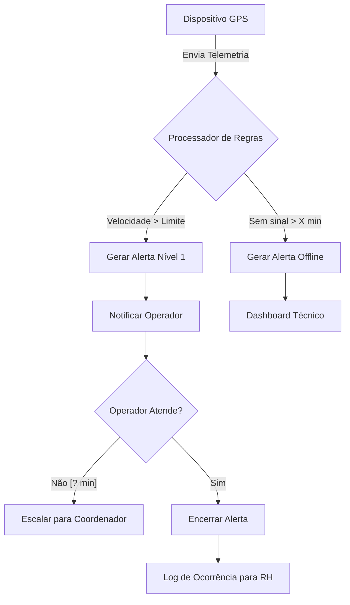

Com base na transcrição da reunião de discovery do projeto **RouteWise**, apresento os requisitos estruturados seguindo os protocolos de Engenharia de Requisitos.

---

### 1. MAPA DE DOMÍNIOS

| Domínio | Descrição | Confiança |
| :--- | :--- | :--- |
| **Telemetria e Rastreamento** | Captura e processamento de dados de GPS e sensores (velocidade, acelerômetro). | Alta |
| **Gestão de Alertas** | Lógica de detecção de infrações e fluxo de escalonamento de notificações. | Alta |
| **Gestão de Ativos (Hardware)** | Monitoramento de saúde, bateria e conectividade dos dispositivos físicos. | Média |
| **Analytics e Reporting** | Consolidação de dados para dashboards gerenciais e exportação para RH. | Alta |
| **Integração Externa** | Sincronização de ocorrências com o sistema de RH de terceiros. | Baixa |

---

### 2. MAPA DE STAKEHOLDERS

| Nome/Papel | Tipo | Requisitos que defendem | Conflitos / Observações |
| :--- | :--- | :--- | :--- |
| **Carlos Mendonça** (Dir. Operações) | Negócio / Usuário | Alertas em tempo real, redução de multas, dashboard automático. | Foco em agilidade; pode subestimar complexidade técnica. |
| **Priya** (TI/Infra) | Técnico | Integridade de dados, suporte a hardware legado, compliance LGPD. | Preocupada com a inconsistência dos sensores entre modelos. |
| **RH** (Não presente) | Negócio | Exportação de ocorrências para avaliação de desempenho. | [VALIDAR COM EQUIPE] Necessidades de integração ainda desconhecidas. |
| **Operador de Despacho** | Usuário Final | Mapa em tempo real e interface de monitoramento. | Não participou diretamente; requisitos via Carlos. |

---

### 3. ESTRUTURA DE ÉPICOS

| Título | Descrição | Complexidade | Justificativa |
| :--- | :--- | :--- | :--- |
| **E01: Monitoramento em Tempo Real** | Motor de processamento de eventos de telemetria e alertas. | **GG** | Exige baixa latência ("tempo real") e lógica de escalonamento complexa. |
| **E02: Gestão de Saúde de Dispositivos** | Dashboard e alertas de status (offline, bateria, sinal). | **M** | Complexidade reside na normalização de dados de hardwares diferentes. |
| **E03: Inteligência de Frota (Analytics)** | Geração automática de relatórios e dashboards de gestão. | **P** | Envolve agregação de dados já existentes na base. |
| **E04: Integração de Conformidade (RH)** | Interface de comunicação com o sistema de RH. | **G** | Depende de sistema terceiro sem API documentada conhecida. |

---

### 4. USER STORIES

#### US01: Alerta de Excesso de Velocidade
- **Card:** Como **Operador de Despacho**, quero **receber alertas automáticos de excesso de velocidade**, para que **eu possa intervir e evitar multas ou acidentes**.
- **Validação INVEST:**
    - [PASS] Independent | [PASS] Negotiable | [PASS] Valuable | [PASS] Estimable
    - [INVEST-FAIL: S] A história é grande pois inclui a lógica de "tempo real" não definida.
    - [INVEST-FAIL: T] O critério "rápido" não é testável sem SLA.
- **Critérios de Aceite (Gherkin):**
    - **Cenário 1: Detecção de excesso de velocidade**
        - Dado que o veículo "ABC-123" tem limite de 80km/h configurado
        - Quando o dispositivo enviar um pacote de telemetria com velocidade de 85km/h
        - Então o sistema deve gerar um alerta de "Excesso de Velocidade" em [A CONFIRMAR] segundos.
    - **Cenário 2: Escalonamento de alerta não atendido**
        - Dado que um alerta de velocidade foi gerado e não foi reconhecido pelo operador
        - Quando transcorrerem [A CONFIRMAR] minutos sem ação
        - Então o sistema deve enviar uma notificação para o Coordenador de Rota.
- **Dependências:** Configuração de limites por veículo (US05).

#### US02: Monitoramento de Status do Dispositivo
- **Card:** Como **Técnico de Dispositivos**, quero **visualizar quais rastreadores estão offline ou com bateria baixa**, para que **eu possa realizar a manutenção proativa do hardware**.
- **Validação INVEST:** [PASS] Todos os critérios.
- **Critérios de Aceite (Gherkin):**
    - **Cenário 1: Dispositivo perde sinal**
        - Dado que um dispositivo enviava sinais regularmente
        - Quando o sistema não receber dados por mais de [A CONFIRMAR] minutos
        - Então o status do dispositivo deve mudar para "Offline" no dashboard técnico.
    - **Cenário 2: Bateria baixa (apenas dispositivos novos)**
        - Dado que o dispositivo é do modelo [NOVO]
        - Quando o nível de bateria reportado for inferior a 15%
        - Então deve ser gerado um alerta de "Bateria Crítica".

---

### 5. PERGUNTAS EM ABERTO

1. **Qual o SLA exato para o "tempo real"?** → *Impacto:* Define a arquitetura de processamento (Stream vs Batch) e custo de infraestrutura.
2. **Qual o tempo de tolerância para considerar um dispositivo "Offline"?** → *Impacto:* Evita falsos positivos em áreas de sombra de sinal citadas por Carlos.
3. **O sistema de RH possui API Rest ou SOAP disponível?** → *Impacto:* Determina se a integração será automática ou via exportação de arquivos (CSV/Excel).
4. **Quais são os limites de velocidade por tipo de veículo e via?** → *Impacto:* Necessário para modelar a tabela de regras de negócio.
5. **O que constitui uma "frenagem brusca" em termos de m/s² no acelerômetro?** → *Impacto:* Sem isso, o QA não consegue simular o evento para teste.

---

### 6. FLAGS DE RISCO

- **[ESPECIFICAÇÃO INVENTADA]** — Latência de alerta e tempo de escalonamento marcados como **[A CONFIRMAR]**. O uso de "rápido" no input é subjetivo.
- **[DEPENDÊNCIA NÃO MAPEADA]** — A integração com o sistema de RH é um risco crítico. Priya não confirmou a existência de API.
- **[VIABILIDADE TÉCNICA SILENCIOSA]** — O uso de acelerômetro para frenagem brusca depende da substituição física de 140 dispositivos. O cronograma de hardware pode bloquear o software.
- **[ANTI-PADRÃO: ESCOPO IMPLICITAMENTE INFINITO]** — "Funcionar em qualquer rota" exige uma base de dados cartográfica com limites de velocidade de todas as vias (ex: integração com Google Maps API ou similar), o que não foi discutido.

---

### 7. CARDS PRONTOS PARA JIRA

---
**Épico:** E01: Monitoramento em Tempo Real
**Feature:** Alertas de Telemetria
**Título:** Como Operador de Despacho, quero receber alertas de excesso de velocidade
**Tipo:** Story
**Story Points:** 8 — [Complexidade alta devido à necessidade de processamento de eventos e regras de escalonamento]
**Component/s:** engine-alertas, dashboard-operador
**Labels:** telemetria, criticidade-alta

**Para que:** Reduzir multas e prevenir acidentes através de intervenção imediata.

**Critérios de Aceite:**
Cenário: Detecção de excesso por tipo de veículo
  Dado que um caminhão pesado tem limite de 70km/h
  Quando a telemetria reportar 75km/h
  Então um alerta visual deve aparecer no dashboard em menos de [A CONFIRMAR] segundos.

Cenário: Escalonamento de alerta
  Dado um alerta ativo e não reconhecido
  Quando o timer de [A CONFIRMAR] minutos expirar
  Então o sistema deve disparar notificação para o perfil "Coordenador".

**Dependências:** US05 (Cadastro de limites de velocidade)
**Definition of Ready:** [⚠️ Pendente: Definição de SLA de tempo real e tempos de escalonamento]
---

---
**Épico:** E02: Gestão de Saúde de Dispositivos
**Feature:** Inventário de Hardware
**Título:** Como Técnico, quero monitorar o status de conectividade dos GPS
**Tipo:** Story
**Story Points:** 3 — [Trabalho de persistência de estado e interface simples]
**Component/s:** hardware-monitor
**Labels:** manutencao, dispositivos

**Para que:** Identificar falhas de hardware ou áreas sem cobertura rapidamente.

**Critérios de Aceite:**
Cenário: Dispositivo Offline
  Dado um veículo em viagem
  Quando o sistema não receber pacotes por [A CONFIRMAR] minutos
  Então o ícone do veículo no mapa deve mudar para a cor cinza (Offline).

**Dependências:** Nenhuma
**Definition of Ready:** [✅ INVEST validado]
---

---

### 8. DEPENDÊNCIAS NÃO DECLARADAS

1. **Provedor de Mapas/GIS** → US01 (Alertas de Velocidade) → Necessário para saber o limite de velocidade da via atual se não for cadastrado manualmente.
2. **Serviço de Notificação (Push/SMS/Email)** → US01 (Escalonamento) → Necessário para notificar coordenadores fora da plataforma.
3. **Parecer Jurídico LGPD** → Todo o sistema → Bloqueia a entrada em produção de dados que identifiquem comportamento do motorista.

---

### 9. DIAGRAMA DE FLUXO (Mermaid)

---
⚠️ **Este output é um rascunho analítico. Requer revisão humana antes de entrar em sprint. Valide: viabilidade técnica, compliance/LGPD e dependências não mapeadas.**